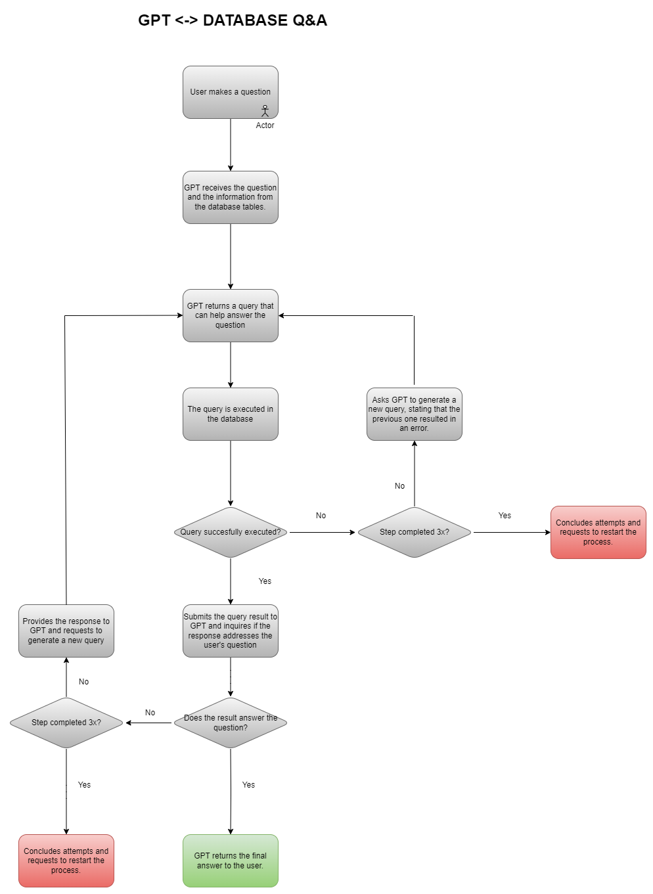

# GPT <-> Database Q&A

## Overview
This repository hosts a proof of concept for integrating OpenAI's ChatGPT with an Azure SQL Database to facilitate answering questions using data within the database. The integration aims to provide a seamless natural language querying interface.

## Security and Credentials
As part of our commitment to security best practices, the server credentials and API key used during the development of this POC have been permanently deleted and are no longer available. You should create your SQL Database and have your own Open AI api key.

## Workflow
The process flow of the integration is detailed in the workflow diagram included in the repository. Each step in the workflow is implemented as a function in `src/gpt_db_assistant.py`, with comments in the code that correspond to the description in the workflow boxes.

### Detailed Workflow Steps:
1. **User makes a question (Actor):** The interaction begins with the user's natural language question.
2. **GPT receives the question:** ChatGPT processes the question and gathers necessary information from the database tables.
3. **GPT returns a query:** ChatGPT formulates a SQL query to retrieve the answer from the database.
4. **The query is executed:** The SQL query is run against the Azure SQL Database.
5. **Query Execution Feedback Loop:**
   - If the query is successful, the result is submitted back to GPT to check if it answers the user's question.
   - If the query fails, ChatGPT attempts to generate a new query. This error handling loop continues for a maximum of three attempts before concluding to restart the process.
6. **Answering the User's Question:**
   - If the query result is satisfactory, ChatGPT returns the final answer to the user.
   - If after three attempts the result is still not satisfactory, the process concludes and a restart is suggested.

## Repository Structure
- `notebooks`: Contains Jupyter notebooks for exploratory purposes and initial testing.
- `src`: Includes the main Python code.

## How to Use
1. Set up an Azure SQL Database with the necessary data.
2. Obtain an API key from OpenAI for accessing ChatGPT.
3. Clone this repository to your local machine.
4. Update the `src/config.ini` file
5. Install the dependencies listed in `requirements.txt`.
6. streamlit run src/main.py